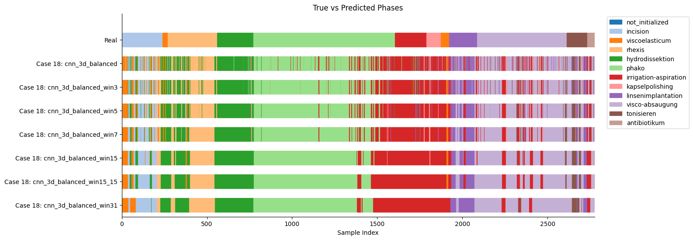
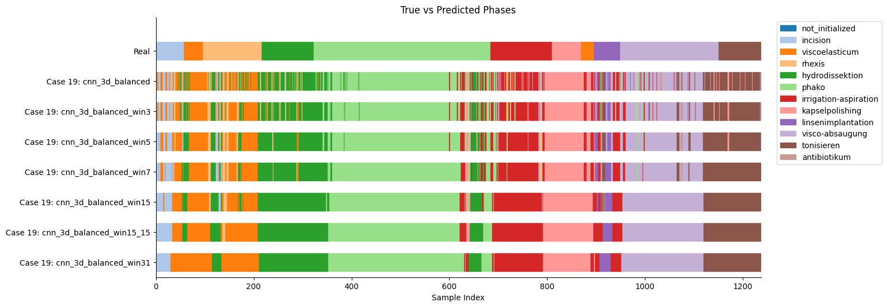
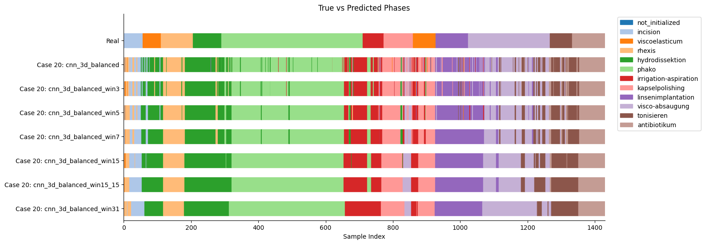
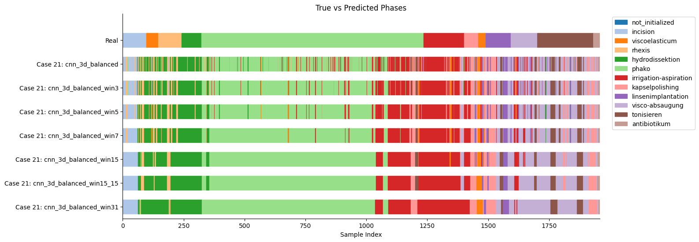
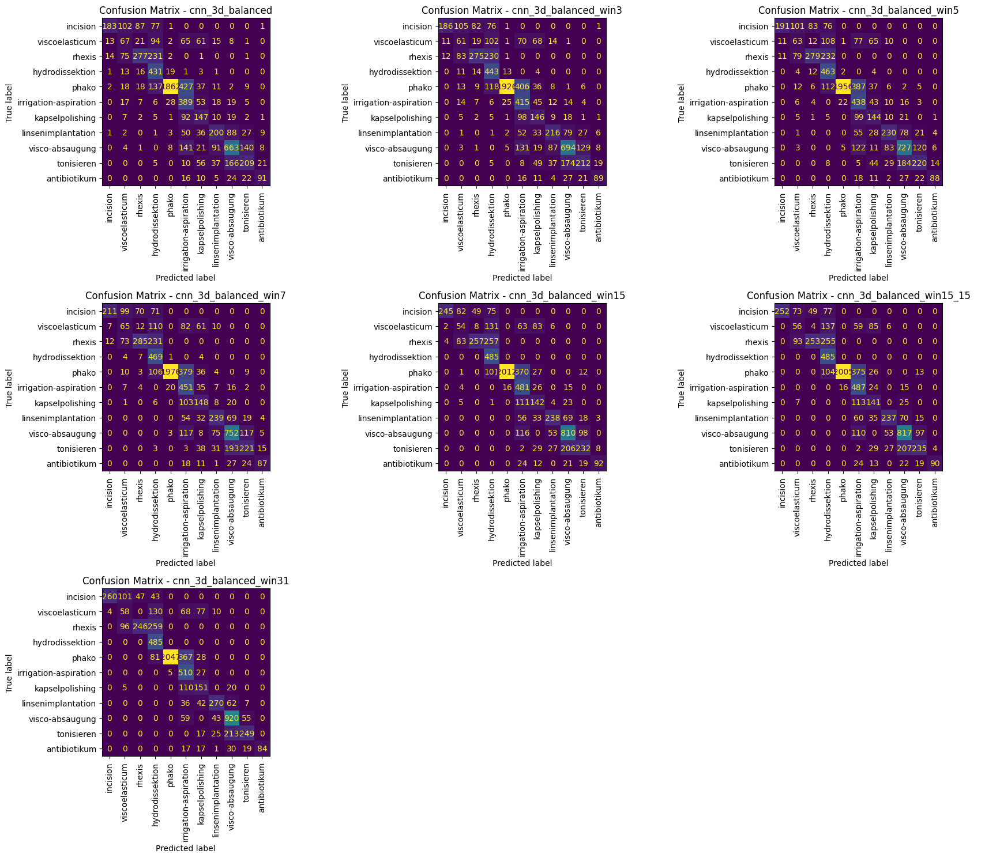

# 1
## Dataset
- `clip_len`: 3

## Architecture
- `meta_hidden`: 8
- `classifier`: Sequential model in -> 1024 -> 512 -> 256 -> class

## Stats
### Epoch 13
| **Model** | **Accuracy** | **Precision** | **Recall** | **F1** | **Weighted F1** |
| --- | --- | --- | --- | --- | --- |
| **cnn_3d_balanced** | 0.6106 | 0.6869 | 0.6106 | 0.5255 | 0.6256 |
| **cnn_3d_balanced_win3** | 0.6300 | 0.7035 | 0.6300 | 0.5395 | 0.6430 |
| **cnn_3d_balanced_win5** | 0.6484 | 0.7199 | 0.6484 | 0.5577 | 0.6593 |
| **cnn_3d_balanced_win7** | 0.6626 | 0.7325 | 0.6626 | 0.5732 | 0.6728 |
| **cnn_3d_balanced_win15** | 0.6821 | 0.7558 | 0.6821 | 0.5933 | 0.6902 |
| **cnn_3d_balanced_win15_15** | 0.6834 | 0.7604 | 0.6834 | 0.5966 | 0.6919 |
| **cnn_3d_balanced_win31** | **0.7134** | 0.7840 | 0.7134 | ***0.6222*** | 0.7185 |

### Epoch 14
| **Model** | **Accuracy** | **Precision** | **Recall** | **F1** | **Weighted F1** |
| --- | --- | --- | --- | --- | --- |
| **cnn_3d_balanced** | 0.6109 | 0.6910 | 0.6109 | 0.5305 | 0.6284 |
| **cnn_3d_balanced_win3** | 0.6303 | 0.7052 | 0.6303 | 0.5455 | 0.6455 |
| **cnn_3d_balanced_win5** | 0.6527 | 0.7231 | 0.6527 | 0.5678 | 0.6661 |
| **cnn_3d_balanced_win7** | 0.6630 | 0.7321 | 0.6630 | 0.5779 | 0.6751 |
| **cnn_3d_balanced_win15** | 0.6852 | 0.7520 | 0.6852 | 0.6035 | 0.6953 |
| **cnn_3d_balanced_win15_15** | 0.6891 | 0.7565 | 0.6891 | 0.6068 | 0.6983 |
| **cnn_3d_balanced_win31** | **0.7046** | 0.7699 | 0.7046 | **0.6175** | 0.7121 |

---
---

  

---
---

# Overall Best
Tried with frozen weights, overfitting did not happen, however the results are sub optimal due to small training set.

#### Case 18

#### Case 19

#### Case 20

#### Case 21

| **Model** | **Accuracy** | **Precision** | **Recall** | **F1** | **Weighted F1** |
| --- | --- | --- | --- | --- | --- |
| **cnn_3d_balanced** | 0.6106 | 0.6869 | 0.6106 | 0.5255 | 0.6256 |
| **cnn_3d_balanced_win3** | 0.6300 | 0.7035 | 0.6300 | 0.5395 | 0.6430 |
| **cnn_3d_balanced_win5** | 0.6484 | 0.7199 | 0.6484 | 0.5577 | 0.6593 |
| **cnn_3d_balanced_win7** | 0.6626 | 0.7325 | 0.6626 | 0.5732 | 0.6728 |
| **cnn_3d_balanced_win15** | 0.6821 | 0.7558 | 0.6821 | 0.5933 | 0.6902 |
| **cnn_3d_balanced_win15_15** | 0.6834 | 0.7604 | 0.6834 | 0.5966 | 0.6919 |
| **cnn_3d_balanced_win31** | **0.7134** | 0.7840 | 0.7134 | ***0.6222*** | 0.7185 |