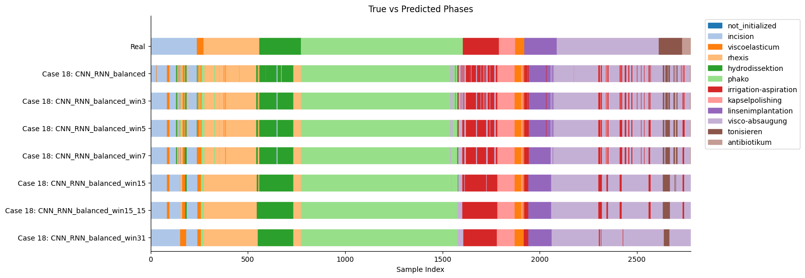
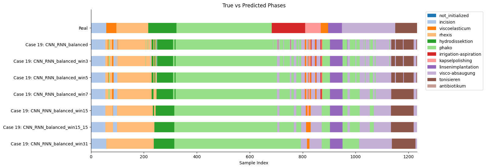
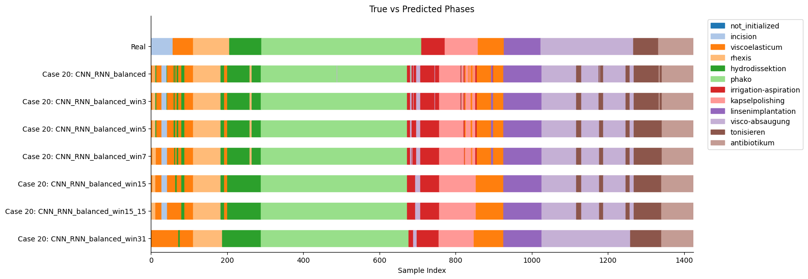
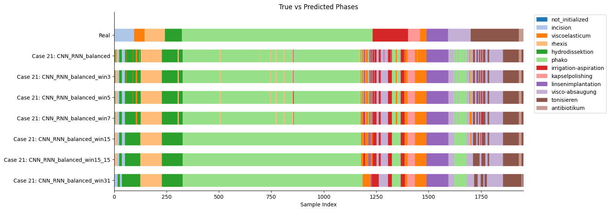
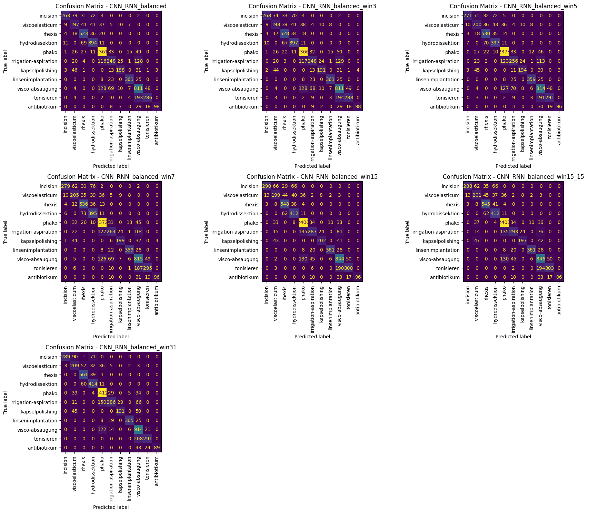

# 1
## Dataset
- `clip_len`: 12
- `stride`: 6

## Architecture
- `hidden_size`: 256
- `num_layers`: 2
- `meta_hidden`: 16

## Stats
### Epoch 8
| **Model** | **Accuracy** | **Precision** | **Recall** | **F1** | **Weighted F1** |
| --- | --- | --- | --- | --- | --- |
| **CNN_RNN_balanced** | 0.8007 | 0.8227 | 0.8007 | 0.7166 | 0.7940 |
| **CNN_RNN_balanced_win3** | 0.8048 | 0.8274 | 0.8048 | 0.7212 | 0.7978 |
| **CNN_RNN_balanced_win5** | 0.8088 | 0.8318 | 0.8088 | 0.7239 | 0.8013 |
| **CNN_RNN_balanced_win7** | 0.8113 | 0.8354 | 0.8113 | 0.7268 | 0.8038 |
| **CNN_RNN_balanced_win15** | 0.8233 | 0.8490 | 0.8233 | 0.7438 | 0.8162 |
| **CNN_RNN_balanced_win15_15** | 0.8256 | 0.8538 | 0.8256 | ***0.7466*** | 0.8181 |
| **CNN_RNN_balanced_win31** | **0.8275** | 0.8563 | 0.8275 | 0.7409 | 0.8167 |

### Epoch 13
| **Model** | **Accuracy** | **Precision** | **Recall** | **F1** | **Weighted F1** |
| --- | --- | --- | --- | --- | --- |
| **CNN_RNN_balanced** | 0.7913 | 0.8235 | 0.7913 | 0.7125 | 0.7876 |
| **CNN_RNN_balanced_win3** | 0.7932 | 0.8263 | 0.7932 | 0.7147 | 0.7894 |
| **CNN_RNN_balanced_win5** | 0.7967 | 0.8303 | 0.7967 | 0.7194 | 0.7931 |
| **CNN_RNN_balanced_win7** | 0.7979 | 0.8318 | 0.7979 | 0.7214 | 0.7942 |
| **CNN_RNN_balanced_win15** | 0.8022 | 0.8366 | 0.8022 | 0.7256 | 0.7987 |
| **CNN_RNN_balanced_win15_15** | **0.8037** | 0.8374 | 0.8037 | 0.7277 | 0.8000 |
| **CNN_RNN_balanced_win31** | 0.8144 | 0.8522 | 0.8144 | **0.7332** | 0.8083 |

---
---

  

---
---

# 2
## Dataset
- `clip_len`: 8
- `stride`: 4

## Architecture
- `hidden_size`: 128
- `num_layers`: 3
- `meta_hidden`: 12
- `classifier`: Sequential model in -> class*2 -> class

## Stats
### Epoch 7
| **Model** | **Accuracy** | **Precision** | **Recall** | **F1** | **Weighted F1** |
| --- | --- | --- | --- | --- | --- |
| **CNN_RNN_balanced** | 0.7760 | 0.7823 | 0.0.7760 | 0.7244 | 0.7722 |
| **CNN_RNN_balanced_win3** | 0.7793 | 0.7850 | 0.0.7793 | 0.7287 | 0.7753 |
| **CNN_RNN_balanced_win5** | 0.7829 | 0.7890 | 0.0.7829 | 0.7325 | 0.7793 |
| **CNN_RNN_balanced_win7** | 0.7875 | 0.7936 | 0.0.7875 | 0.7395 | 0.7841 |
| **CNN_RNN_balanced_win15** | 0.8043 | 0.8112 | 0.0.8043 | 0.7586 | 0.8008 |
| **CNN_RNN_balanced_win15_15** | 0.8050 | 0.8121 | 0.0.8050 | 0.7590 | 0.8015 |
| **CNN_RNN_balanced_win31** | **0.8154** | 0.8285 | 0.0.8154 | ***0.7653*** | 0.8112 |

### Epoch 8
| **Model** | **Accuracy** | **Precision** | **Recall** | **F1** | **Weighted F1** |
| --- | --- | --- | --- | --- | --- |
| **CNN_RNN_balanced** | 0.7603 | 0.7823 | 0.7603 | 0.6822 | 0.7520 |
| **CNN_RNN_balanced_win3** | 0.7626 | 0.7849 | 0.7626 | 0.6850 | 0.7542 |
| **CNN_RNN_balanced_win5** | 0.7661 | 0.7876 | 0.7661 | 0.6877 | 0.7572 |
| **CNN_RNN_balanced_win7** | 0.7695 | 0.7916 | 0.7695 | 0.6912 | 0.7608 |
| **CNN_RNN_balanced_win15** | 0.7788 | 0.8025 | 0.7788 | 0.6988 | 0.7690 |
| **CNN_RNN_balanced_win15_15** | 0.7802 | 0.8041 | 0.7802 | 0.6997 | 0.7701 |
| **CNN_RNN_balanced_win31** | **0.7925** | 0.8162 | 0.7925 | **0.7122** | 0.7842 |

---
---

  

---
---

# 3
## Dataset
- `clip_len`: 16
- `stride`: 8

## Architecture
- `hidden_size`: 128
- `num_layers`: 1
- `meta_hidden`: 8
- `frame_norm nn`: One layer only

## Stats
### Epoch 6
| **Model** | **Accuracy** | **Precision** | **Recall** | **F1** | **Weighted F1** |
| --- | --- | --- | --- | --- | --- |
| **CNN_RNN_balanced** | 0.7794 | 0.7987 | 0.7794 | 0.6986 | 0.7771 |
| **CNN_RNN_balanced_win3** | 0.7848 | 0.8038 | 0.7848 | 0.7044 | 0.7824 |
| **CNN_RNN_balanced_win5** | 0.7923 | 0.8108 | 0.7923 | 0.7133 | 0.7901 |
| **CNN_RNN_balanced_win7** | 0.7981 | 0.8152 | 0.7981 | 0.7190 | 0.7952 |
| **CNN_RNN_balanced_win15** | 0.8068 | 0.8258 | 0.8068 | 0.7266 | 0.8045 |
| **CNN_RNN_balanced_win15_15** | 0.8105 | 0.8296 | 0.8105 | 0.7302 | 0.8083 |
| **CNN_RNN_balanced_win31** | **0.8195** | 0.8414 | 0.8195 | ***0.7384*** | 0.8155 |

### Epoch 15
| **Model** | **Accuracy** | **Precision** | **Recall** | **F1** | **Weighted F1** |
| --- | --- | --- | --- | --- | --- |
| **CNN_RNN_balanced** | 0.7755 | 0.7899 | 0.7755 | 0.6909 | 0.7663 |
| **CNN_RNN_balanced_win3** | 0.7802 | 0.7937 | 0.7802 | 0.6971 | 0.7709 |
| **CNN_RNN_balanced_win5** | 0.7848 | 0.7971 | 0.7848 | 0.7011 | 0.7742 |
| **CNN_RNN_balanced_win7** | 0.7897 | 0.8021 | 0.7897 | 0.7056 | 0.7791 |
| **CNN_RNN_balanced_win15** | 0.8050 | 0.8205 | 0.8050 | 0.7230 | 0.7939 |
| **CNN_RNN_balanced_win15_15** | **0.8078** | 0.8233 | 0.8078 | **0.7272** | 0.7968 |
| **CNN_RNN_balanced_win31** | 0.8052 | 0.8222 | 0.8052 | 0.7183 | 0.7912 |

---
---

  

---
---

# Overall Best
Second model with more complex prediction head, and shorter clips.
Epoch 7 with window of 31 frames.

#### Case 18

#### Case 19

#### Case 20

#### Case 21

| **Model** | **Accuracy** | **Precision** | **Recall** | **F1** | **Weighted F1** |
| --- | --- | --- | --- | --- | --- |
| **CNN_RNN_balanced** | 0.7760 | 0.7823 | 0.0.7760 | 0.7244 | 0.7722 |
| **CNN_RNN_balanced_win3** | 0.7793 | 0.7850 | 0.0.7793 | 0.7287 | 0.7753 |
| **CNN_RNN_balanced_win5** | 0.7829 | 0.7890 | 0.0.7829 | 0.7325 | 0.7793 |
| **CNN_RNN_balanced_win7** | 0.7875 | 0.7936 | 0.0.7875 | 0.7395 | 0.7841 |
| **CNN_RNN_balanced_win15** | 0.8043 | 0.8112 | 0.0.8043 | 0.7586 | 0.8008 |
| **CNN_RNN_balanced_win15_15** | 0.8050 | 0.8121 | 0.0.8050 | 0.7590 | 0.8015 |
| **CNN_RNN_balanced_win31** | **0.8154** | 0.8285 | 0.0.8154 | ***0.7653*** | 0.8112 |