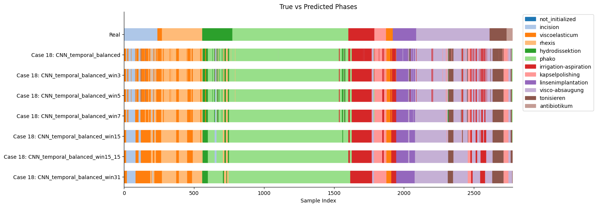
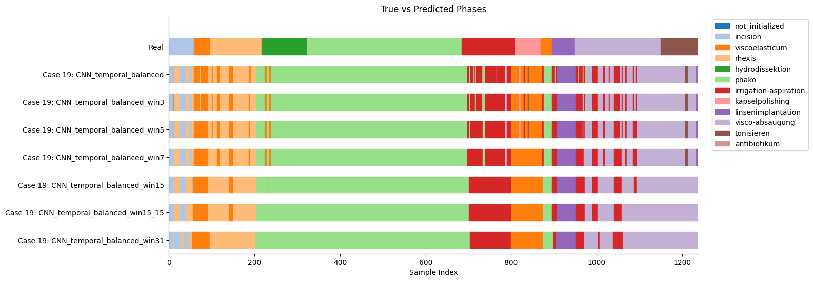
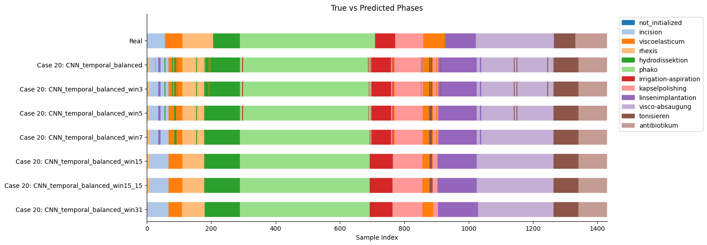
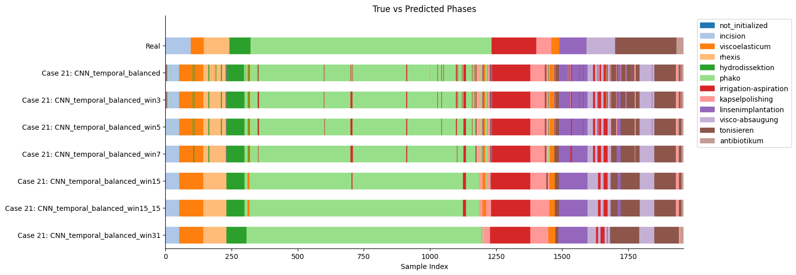
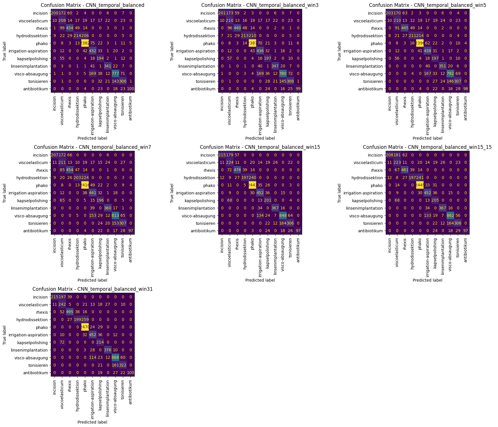

# 1
## Dataset
- `window_size`: 3

## Architecture
- `pool_type`: mean
- `meta_hidden`: 16

## Stats
### Epoch 7
| **Model** | **Accuracy** | **Precision** | **Recall** | **F1** | **Weighted F1** |
| --- | --- | --- | --- | --- | --- |
| **CNN_temporal_balanced** | 0.7550 | 0.7777 | 0.7550 | 0.6793 | 0.7547 |
| **CNN_temporal_balanced_win3** | 0.7591 | 0.7813 | 0.7591 | 0.6836 | 0.7584 |
| **CNN_temporal_balanced_win5** | 0.7631 | 0.7839 | 0.7631 | 0.6872 | 0.7618 |
| **CNN_temporal_balanced_win7** | 0.7708 | 0.7896 | 0.7708 | 0.6939 | 0.7684 |
| **CNN_temporal_balanced_win15** | 0.7872 | 0.8063 | 0.7872 | 0.7119 | 0.7835 |
| **CNN_temporal_balanced_win15_15** | 0.7895 | 0.8091 | 0.7895 | 0.7135 | 0.7854 |
| **CNN_temporal_balanced_win31** | **0.8044** | 0.8237 | 0.8044 | ***0.7345*** | 0.7996 |

### Epoch 10
| **Model** | **Accuracy** | **Precision** | **Recall** | **F1** | **Weighted F1** |
| --- | --- | --- | --- | --- | --- |
| **CNN_temporal_balanced** | 0.7633 | 0.8009 | 0.7633 | 0.6789 | 0.7653 |
| **CNN_temporal_balanced_win3** | 0.7664 | 0.8044 | 0.7664 | 0.6816 | 0.7683 |
| **CNN_temporal_balanced_win5** | 0.7725 | 0.8123 | 0.7725 | 0.6885 | 0.7747 |
| **CNN_temporal_balanced_win7** | 0.7799 | 0.8201 | 0.7799 | 0.6969 | 0.7825 |
| **CNN_temporal_balanced_win15** | 0.7960 | 0.8374 | 0.7960 | 0.7178 | 0.7993 |
| **CNN_temporal_balanced_win15_15** | 0.7989 | 0.8403 | 0.7989 | 0.7214 | 0.8021 |
| **CNN_temporal_balanced_win31** | **0.8084** | 0.8501 | 0.8084 | **0.7329** | 0.8103 |

---
---

  

---
---

# 2
## Dataset
- `window_size`: 3

## Architecture
- `pool_type`: mean
- `meta_hidden`: 8
- `classifier`: Sequential model in -> class*2 -> class

## Stats
### Epoch 11
| **Model** | **Accuracy** | **Precision** | **Recall** | **F1** | **Weighted F1** |
| --- | --- | --- | --- | --- | --- |
| **CNN_temporal_balanced** | 0.7650 | 0.7974 | 0.7650 | 0.6793 | 0.7664 |
| **CNN_temporal_balanced_win3** | 0.7696 | 0.8024 | 0.7696 | 0.6847 | 0.7708 |
| **CNN_temporal_balanced_win5** | 0.7731 | 0.8065 | 0.7731 | 0.6899 | 0.7743 |
| **CNN_temporal_balanced_win7** | 0.7780 | 0.8139 | 0.7780 | 0.6957 | 0.7795 |
| **CNN_temporal_balanced_win15** | 0.7912 | 0.8324 | 0.7912 | 0.7115 | 0.7932 |
| **CNN_temporal_balanced_win15_15** | 0.7915 | 0.8349 | 0.7915 | 0.7117 | 0.7936 |
| **CNN_temporal_balanced_win31** | **0.7972** | 0.8425 | 0.7972 | **0.7169** | 0.7997 |

### Epoch 12
| **Model** | **Accuracy** | **Precision** | **Recall** | **F1** | **Weighted F1** |
| --- | --- | --- | --- | --- | --- |
| **CNN_temporal_balanced** | 0.7757 | 0.7911 | 0.7757 | 0.6833 | 0.7674 |
| **CNN_temporal_balanced_win3** | 0.7787 | 0.7939 | 0.7787 | 0.6862 | 0.7700 |
| **CNN_temporal_balanced_win5** | 0.7844 | 0.8001 | 0.7844 | 0.6923 | 0.7752 |
| **CNN_temporal_balanced_win7** | 0.7885 | 0.8049 | 0.7885 | 0.6951 | 0.7787 |
| **CNN_temporal_balanced_win15** | 0.8023 | 0.8265 | 0.8023 | 0.7146 | 0.7938 |
| **CNN_temporal_balanced_win15_15** | 0.8039 | 0.8285 | 0.8039 | 0.7152 | 0.7949 |
| **CNN_temporal_balanced_win31** | **0.8106** | 0.8386 | 0.8106 | ***0.7251*** | 0.8019 |

---
---

  

---
---

# 3
## Dataset
- `window_size`: 3

## Architecture
- `pool_type`: mean
- `meta_hidden`: 8
- `cnn`: **Frozen**
- `classifier`: Sequential model in -> 256 -> class * 4 -> class

## Stats
### Epoch 11
| **Model** | **Accuracy** | **Precision** | **Recall** | **F1** | **Weighted F1** |
| --- | --- | --- | --- | --- | --- |
| **CNN_temporal_balanced** | 0.4593 | 0.6645 | 0.4593 | 0.4561 | 0.4744 |
| **CNN_temporal_balanced_win3** | 0.4636 | 0.6691 | 0.4636 | 0.4607 | 0.4786 |
| **CNN_temporal_balanced_win5** | 0.4657 | 0.6730 | 0.4657 | 0.4628 | 0.4801 |
| **CNN_temporal_balanced_win7** | 0.4671 | 0.6757 | 0.4671 | 0.4630 | 0.4807 |
| **CNN_temporal_balanced_win15** | 0.4748 | 0.6890 | 0.4748 | 0.4730 | 0.4876 |
| **CNN_temporal_balanced_win15_15** | 0.4790 | 0.6943 | 0.4790 | 0.4778 | 0.4924 |
| **CNN_temporal_balanced_win31** | **0.4817** | 0.6969 | 0.4817 | ***0.4812*** | 0.4932 |

---
---

  

---
---

# Overall Best
The best model overall was the simplest, which was used for the previous experiments.

#### Case 18

#### Case 19

#### Case 20

#### Case 21

| **Model** | **Accuracy** | **Precision** | **Recall** | **F1** | **Weighted F1** |
| --- | --- | --- | --- | --- | --- |
| **CNN_temporal_balanced** | 0.7550 | 0.7777 | 0.7550 | 0.6793 | 0.7547 |
| **CNN_temporal_balanced_win3** | 0.7591 | 0.7813 | 0.7591 | 0.6836 | 0.7584 |
| **CNN_temporal_balanced_win5** | 0.7631 | 0.7839 | 0.7631 | 0.6872 | 0.7618 |
| **CNN_temporal_balanced_win7** | 0.7708 | 0.7896 | 0.7708 | 0.6939 | 0.7684 |
| **CNN_temporal_balanced_win15** | 0.7872 | 0.8063 | 0.7872 | 0.7119 | 0.7835 |
| **CNN_temporal_balanced_win15_15** | 0.7895 | 0.8091 | 0.7895 | 0.7135 | 0.7854 |
| **CNN_temporal_balanced_win31** | **0.8044** | 0.8237 | 0.8044 | ***0.7345*** | 0.7996 |